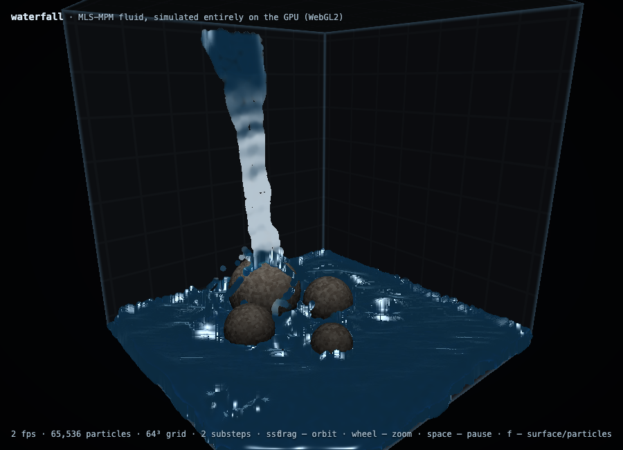

# waterfall

A real-time 3D fluid simulation — a waterfall splashing onto rocks inside a
cube — running entirely on the GPU in the browser. Two backends share one
app: **WebGPU** (compute shaders, used when available) and **WebGL2** (a
fallback that emulates compute with render passes).



**Live physics, no baked animation:** ~262,000 fluid particles simulated with
**MLS-MPM** (Moving Least Squares Material Point Method, [Hu et al.,
SIGGRAPH 2018](https://yuanming.taichi.graphics/publication/2018-mlsmpm/)),
the same family of methods behind most modern real-time fluid demos.

## Running

Any static file server works (ES modules require http):

```sh
python3 -m http.server 8123
# then open http://localhost:8123
```

Controls: **drag a rock** to move it (the water is pushed aside as it goes),
**drag** elsewhere to orbit, **wheel** to zoom, **space** to pause,
**f** to toggle between the water surface and raw particle view. The panel
in the top-right corner adjusts grid resolution (32³–128³) and particle
count (128²–512²); changing either restarts the water in place (the camera
survives).

## How it works

Everything — particle state, the simulation grid, and all physics — lives on
the GPU. Per substep:

1. **P2G pass 1** — each particle scatters mass and momentum (including its
   affine velocity matrix *C*) to its 27 neighboring grid cells. On WebGPU
   this is a fixed-point `atomicAdd` into a 3D grid storage buffer; on
   WebGL2 it is emulated by rendering one GL point per (particle, cell)
   pair into a tiled grid texture with additive blending.
2. **Density** — a fragment pass gathers grid mass back to each particle and
   evaluates a weakly compressible equation of state (no pressure solve
   needed — this is what makes MLS-MPM so friendly to GPUs).
3. **P2G pass 2** — pressure and viscosity forces are scattered to the grid,
   fused into grid momentum (eq. 16 of the MLS-MPM paper).
4. **Grid update** — momentum → velocity, gravity, a CFL velocity clamp, and
   free-slip boundary conditions against the cube walls and the rock SDF.
   Rock positions are uniforms, so rocks can be dragged live; a dragged
   rock's velocity enters this boundary condition, shoving water aside.
5. **G2P** — particles gather their new velocity and affine matrix from the
   grid and advect. Particles are recycled through the spout on a fixed
   lifetime, so the waterfall runs forever.

On WebGL2 the 3D grid is tiled slice-by-slice into a 2D texture (WebGL2
can't render into 3D textures per-slice with blending) — e.g. 64³ into
512×512, with the tiling derived per grid size — and particle state ping-
pongs through float MRT textures; the WebGPU backend uses flat storage
buffers updated in place. Rocks and walls are raytraced analytically in a
fragment shader that writes real depth, so the water composites correctly
against them. See `docs/perf-webgpu.md` for a measured comparison of the
two backends.

### Rendering

The water surface uses **screen-space fluid rendering** (van der Laan et al.,
I3D 2009): sphere impostors write linear view-space depth to an offscreen
target (z-tested against the raytraced scene depth), a depth-aware separable
blur smooths it into a continuous surface, and an additive half-resolution
pass accumulates thickness plus a speed-weighted foam channel. The blur also
closes gaps between droplets at compatible depths (a morphological closing
that never grows outer silhouettes), and the composite fades sparse water by
thickness, so spray reads as translucent droplets rather than opaque spheres. A composite
pass reconstructs normals from the smoothed depth and shades the surface:
refraction of the scene, Beer–Lambert absorption by thickness, Fresnel,
specular, and foam. Press **f** (or `?r=points`) for the raw shaded-particle
view. Known simplification: the thickness pass has no occlusion test, so
water behind a rock still contributes thickness where nearer water is
visible — visually minor.

## URL parameters

| param  | default    | meaning                                            |
| ------ | ---------- | -------------------------------------------------- |
| `g`    | 128        | grid resolution per axis (32, 64, 96, or 128)      |
| `p`    | 512        | particle texture size (`p`² particles)             |
| `s`    | `g` / 32   | simulation substeps per frame                      |
| `l`    | 2600       | particle lifetime in substeps (spout recycling)    |
| `warm` | 0          | substeps to pre-simulate before the first frame    |
| `r`    | `ssf`      | rendering: `ssf` (water surface) or `points`       |
| `api`  | auto       | backend: `webgpu` or `webgl2` (auto-detects)       |
| `bench`| off        | time N frames after warmup, then freeze + report   |
| `dbg`  | off        | overlay with GPU-readback particle statistics      |

Example: [`?p=128&s=3`](http://localhost:8123/?p=128&s=3) for slower machines.

## Requirements

WebGPU where available; otherwise WebGL2 with `EXT_color_buffer_float` and
`EXT_float_blend` (available in all current desktop browsers).

## License

MIT
